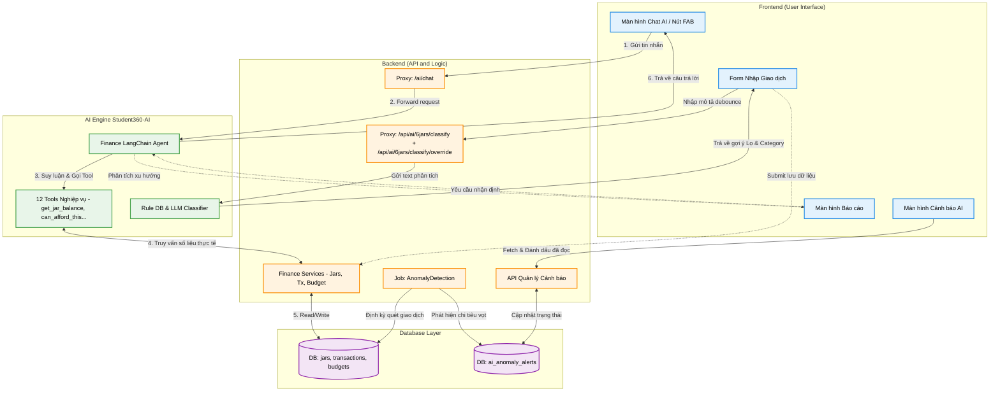

# Đặc tả Kỹ thuật: Hệ thống Quản lý Tài chính 6 Lọ & AI (Student360)

## 1. Kiến trúc Tổng quan (Architecture Overview)

Hệ thống quản lý tài chính cá nhân Student360 áp dụng phương pháp "6 cái lọ" (6 Jars), kết hợp chặt chẽ với AI Agent để tự động hóa, phân tích và hỗ trợ ra quyết định.

- **Frontend (FE):** Xây dựng luồng giao diện người dùng, quản lý state với cơ chế query invalidation (tải lại dữ liệu ngay sau mutation). Tương tác với Backend, chưa gọi trực tiếp AI Core.
- **Backend (BE):** Đóng vai trò xử lý nghiệp vụ, tính toán số dư thực (dựa trên giao dịch), khởi tạo dữ liệu mặc định (lazy-create) và làm Proxy giao tiếp với hệ thống AI.
- **AI Agent (Student360-AI):** Finance tool-calling agent (LLM + LangChain) với tập hợp 12 tools nghiệp vụ tiếng Việt, phục vụ tra cứu, thống kê và tư vấn tài chính.

---

## 2. Luồng Hoạt động Cốt lõi (Core Business Flows)

### 2.1. Khởi tạo & Trạng thái Ban đầu

- **Trigger:** Người dùng truy cập tab **Tài chính**.
- **Logic (BE - `JarsService`):**
  - Kiểm tra sự tồn tại của dữ liệu.
  - Nếu là lần đầu: Tự động tạo 6 hũ hệ thống mặc định (`DEFAULT_SYSTEM_JARS`): _Essentials (55%), Education (10%), Investment (10%), Sharing (5%), Enjoyment (10%), Reserve (10%)_.
- **Logic (FE):** Gửi các request đồng thời để render màn hình Snapshot:
  - Lấy danh sách lọ (cơ cấu, số dư, %, màu sắc, icon).
  - Lấy danh sách giao dịch gần đây.
  - Lấy dữ liệu giao dịch trong tháng để dựng biểu đồ (Chart) thu/chi.

### 2.2. Xử lý Giao dịch (Transactions)

_Nguyên tắc: Số dư hũ là kết quả tính toán từ dòng tiền giao dịch thực tế, không dùng số dư ước lượng hay lưu cứng thiếu đồng bộ._

- **Thu nhập (Income):**
  - _Ghi đơn lọ:_ Nạp tiền trực tiếp vào 1 lọ cụ thể.
  - _Phân bổ (Distribute):_ POST `/distribute-income`. Phân bổ tổng thu nhập vào các lọ theo tỷ lệ % mặc định hoặc do người dùng tùy chỉnh.
- **Chi tiêu (Expense):**
  - Người dùng chọn lọ nguồn và danh mục (Category).
  - BE (`FinancialTransactionsService`) kiểm tra điều kiện: `Số tiền <= Số dư lọ hiện tại`.
  - Hợp lệ -> Lưu giao dịch -> Cập nhật số dư lọ.
- **Chuyển tiền (Transfer):**
  - Chọn lọ nguồn & lọ đích.
  - Kiểm tra số dư lọ nguồn -> Hợp lệ -> POST `/transfer` -> Cập nhật số dư 2 lọ.
- **Đồng bộ UI:** Sau bất kỳ thao tác mutation nào (tạo/sửa/xóa), FE kích hoạt invalidate queries để làm mới toàn bộ số liệu trên màn Snapshot và Chi tiết.

### 2.3. Quản lý Lọ & Cấu hình (Jars Management)

- **Chi tiết Lọ:** Màn hình riêng (route động theo `moneyJarId`), hiển thị số dư, lịch sử giao dịch và biểu đồ tháng cục bộ của lọ đó.
- **Tùy chỉnh Lọ:** Hỗ trợ CRUD lọ, điều chỉnh phần trăm phân bổ. Khi xóa một lọ có số dư, hệ thống bắt buộc chuyển tiền sang lọ khác (tự động sinh cặp giao dịch nội bộ expense/income để giữ tính toàn vẹn dữ liệu).
- **Cảnh báo mức lọ:** User tự cấu hình cảnh báo theo % hoặc số tiền. BE dùng lazy-create lưu vào bảng `jar_notification_settings`.

---

## 3. Trạng thái Tích hợp AI (AI Integration Status)

Hệ thống AI không chỉ dừng ở việc "hỏi/đáp", mà được thiết kế để nhúng sâu vào các luồng nghiệp vụ. Dưới đây là trạng thái tích hợp thực tế giữa UI và AI Layer:

### 3.1. AI Chat (Trợ lý Tài chính)

- **Khả năng (AI Core):** Có thể gọi 12 tools (xem số dư, chi tiêu lớn, so sánh tháng, xu hướng, phân tích khả năng chi trả `can_afford_this`...).
- **Hiện trạng FE:**
  - [x] Đã có Entry point qua nút FAB (Floating Action Button) toàn cục.
  - [x] Đã có route màn hình chat riêng biệt.
  - [x] Sử dụng API Proxy từ Backend: `/ai/chat` (chưa gọi thẳng xuống `/api/v1/chat` của Core AI).

### 3.2. Auto-Suggest & Classification (Phân loại tự động)

- **Khả năng (AI Core):** API `/api/v1/classify` gợi ý lọ dựa trên văn bản mô tả giao dịch; API `/api/v1/classify/override` ghi nhận lựa chọn sửa tay của user để học preference.
- **Proxy tại BE (6 Jars):**
  - `POST /api/ai/6jars/classify` (FE debounce khi user dừng gõ)
  - `POST /api/ai/6jars/classify/override` (FE gọi sau khi lưu transaction thành công và user chọn lọ khác gợi ý AI)
- **Hiện trạng FE:**
  - [ ] **Chưa tích hợp** vào màn hình tạo/sửa giao dịch (Thu nhập/Chi tiêu). Người dùng vẫn đang phải tự chọn lọ và danh mục thủ công.
  - [x] BE đã có API proxy classify + override để sẵn sàng cho Smart Data Entry.

### 3.3. Tự động hóa: Auto-Transfer & Budget

- **Auto-transfer (Chuyển tiền tự động):**
  - [x] Tích hợp hoàn thiện. FE đã có UI vận hành đầy đủ: xem danh sách lịch, tạo mới và sửa lịch. Agent đã có tool `get_auto_transfers` để đọc dữ liệu này.
- **Budget (Ngân sách):**
  - [x] BE đã có bảng `budgets`, Data layer đã có API/hook. Agent có tool `get_budget_status`.
  - [ ] **FE thiếu UI:** Chưa có màn hình/luồng nghiệp vụ hoàn chỉnh để người dùng cấu hình mức ngân sách.

### 3.4. Anomaly Alerts (Cảnh báo Bất thường)

- **Khả năng (BE/AI):** Cron job `AnomalyDetectionJob` quét giao dịch định kỳ, phát hiện chi tiêu tăng vọt/bất thường và lưu vào bảng `ai_anomaly_alerts`. AI Core có endpoint đọc/đánh dấu.
- **Hiện trạng FE:**
  - [x] Đã có màn hình danh sách lịch sử cảnh báo và thao tác đánh dấu đã đọc.
  - [ ] **Thiếu Contextual UI:** Chưa tích hợp sâu vào luồng chính (Chưa có badge đếm số lượng thông báo chưa đọc, chưa có popup cảnh báo tại màn Trang chủ tài chính hoặc màn Báo cáo).

### 3.5. Báo cáo Tổng hợp (Report)

- **Hiện trạng FE:** Đang dừng ở mức hiển thị số liệu thuần túy (Tổng hợp thu/chi theo khoảng ngày, lọc lịch sử phân trang).
- **Gap với AI:**
  - [ ] Chưa có "AI Insight Block" trong màn hình báo cáo. Thiếu các nhận định từ AI như: chỉ ra điểm bất thường, khuyến nghị cắt giảm ở lọ nào, hoặc dự báo khả năng vượt hạn mức trong tương lai gần.

---

## 4. Sơ đồ Luồng hoạt động AI (AI Workflow Diagram)

Biểu đồ dưới đây mô tả cách Frontend tương tác với AI Agent và các tiến trình chạy ngầm (Background Jobs) để xử lý dữ liệu tài chính.



---

## 5. Kế hoạch Hoàn thiện (Actionable TODOs)

Dựa trên thực trạng hệ thống, các công việc ưu tiên cần thực hiện ở giai đoạn tiếp theo để luồng 6 Lọ + AI hoạt động trơn tru:

### 5.1. Hoàn thiện luồng nhập liệu thông minh (Smart Data Entry)

- [ ] Gắn API `POST /api/ai/6jars/classify` vào form Giao dịch.
- [ ] Sau khi lưu giao dịch thành công, nếu user chọn lọ khác với gợi ý AI, gọi `POST /api/ai/6jars/classify/override` để AI học preference.
- [ ] Khi người dùng nhập "Mô tả", hệ thống tự động debounce và pre-select Lọ + Danh mục tương ứng.
- [ ] Đồng bộ danh sách Category mặc định giữa các màn hình, loại bỏ việc gán cứng vào lọ _Essentials_ ở các màn cũ.

### 5.2. Mở khóa tính năng Budget

- [ ] Thiết kế và triển khai màn hình UI cho phép người dùng thiết lập, chỉnh sửa ngân sách (Budgets).
- [ ] Đảm bảo dữ liệu ngân sách sẵn sàng để AI tham chiếu khi đánh giá `can_afford_this`.

### 5.3. Tăng cường trải nghiệm Cảnh báo & Báo cáo (Proactive UI)

- [ ] Thêm icon Chuông thông báo trên Header màn Tài chính.
- [ ] Hiển thị badge đỏ đếm số lượng cảnh báo chưa đọc từ `ai_anomaly_alerts`.
- [ ] Phát triển component "AI Insights" trên màn hình Report để hiển thị tóm tắt, nhận định tài chính thay vì chỉ bảng số liệu thô.

### 5.4. Chi tiết triển khai theo TODO

#### TODO 1. Hoàn thiện luồng nhập liệu thông minh (Smart Data Entry)

**Mục tiêu**

Tự động điền (auto-fill) Lọ và Danh mục (Category) khi người dùng nhập mô tả giao dịch.

**Nơi cài đặt**

- FE: Component Form tạo giao dịch (Thu/Chi).
- BE: Dùng endpoint có sẵn `POST /api/ai/6jars/classify` và `POST /api/ai/6jars/classify/override` để proxy sang AI Core.

**Cách làm**

- FE - Quản lý State và Debounce: Gắn hook `useDebounce` (khoảng 500ms - 800ms) vào state của ô input "Mô tả giao dịch" (Notes/Description).
- FE - Gọi API: Khi giá trị debounce thay đổi (nghĩa là user đã gõ xong và dừng tay), FE âm thầm gửi request chứa text đó lên BE proxy `POST /api/ai/6jars/classify`.
- FE - Cập nhật UI: Khi nhận response (`suggested_jar_code`, `moneyJarId`, `confidence`, `source`), dùng `moneyJarId` để auto-select dropdown Lọ. Nếu `suggested_jar_code = null` thì không auto-fill.
- FE - Gọi override: Sau khi lưu transaction thành công, nếu lọ user chọn khác với `suggested_jar_code` trước đó, gọi `POST /api/ai/6jars/classify/override` với `keyword` và `jar_code` user đã chọn.
- FE - UX gợi ý: Thêm một dấu hiệu nhỏ (ví dụ icon tia chớp) cạnh dropdown để thông báo "AI vừa tự động chọn".

**Ví dụ API (FE dùng trực tiếp)**

1. Classify khi user dừng gõ

Request:

```json
POST /api/ai/6jars/classify
{
  "description": "Đóng tiền học tiếng Anh",
  "amount": 500000
}
```

Response (AI gợi ý thành công):

```json
{
  "suggested_jar_code": "education",
  "suggestedJarCode": "education",
  "moneyJarId": "123e4567-e89b-12d3-a456-426614174000",
  "confidence": 0.95,
  "source": "ai"
}
```

Response (không đủ tin cậy hoặc AI không phân loại được):

```json
{
  "suggested_jar_code": null,
  "suggestedJarCode": null,
  "moneyJarId": null,
  "confidence": 0,
  "source": "ai"
}
```

2. Override khi user chọn lọ khác gợi ý

Request:

```json
POST /api/ai/6jars/classify/override
{
  "keyword": "đóng tiền học tiếng anh",
  "jar_code": "education"
}
```

Response:

```json
204 No Content
```

**Luồng hoạt động mẫu**

User gõ "Đóng tiền học tiếng Anh" -> Ngừng gõ 500ms -> FE tự gọi API -> AI phân tích và trả kết quả -> UI tự động chuyển Lọ thành "Education" và Danh mục thành "Học phí" -> User kiểm tra và bấm "Lưu".

#### TODO 2. Mở khóa tính năng Ngân sách (Budget UI)

**Mục tiêu**

Kích hoạt đầy đủ UI ngân sách để tận dụng data và logic BE đã có sẵn (`budgets`, hook, API).

**Nơi cài đặt**

- FE: Tạo luồng màn hình mới cho tính năng Ngân sách.

**Cách làm**

- FE - Màn danh sách (List): Gọi API `GET` list budgets. Hiển thị dạng card, mỗi card có progress bar thể hiện `Đã chi / Hạn mức` theo tháng.
- FE - Màu progress bar theo ngưỡng: xanh -> vàng -> đỏ theo tỷ lệ phần trăm sử dụng.
- FE - Form cấu hình (CRUD): Tạo modal hoặc screen để tạo/sửa ngân sách với các trường: Chọn Lọ, Hạn mức, Chu kỳ (thường theo tháng).
- FE - Submit dữ liệu: Gọi API `POST/PUT` của BE khi tạo/sửa.
- FE - Cache invalidation: Sau khi tạo/sửa/xóa thành công, gọi invalidate query để reload danh sách ngay lập tức.

**Luồng hoạt động mẫu**

User vào tab Ngân sách -> Bấm "Thêm mới" -> Cài hạn mức X cho lọ Enjoyment trong tháng hiện tại -> Lưu -> Dữ liệu lưu xuống BE -> AI Agent (tool `get_budget_status`) có thể trả lời chính xác câu hỏi: "Tháng này tôi còn bao nhiêu ngân sách để đi chơi?".

#### TODO 3. Tăng cường trải nghiệm Cảnh báo và Báo cáo (Proactive UI)

**Mục tiêu**

Đưa kết quả AI tính toán ngầm ra UI chính để người dùng nhận biết sớm và hành động nhanh.

**Nơi cài đặt**

- FE: Component Layout chung (Header/TopBar) và màn hình Báo cáo (Report Screen).
- BE/AI: Endpoint sinh đoạn text phân tích (Insight) dựa trên số liệu tháng.

**Cách làm**

**Chuông cảnh báo (Alerts)**

- FE: Thêm icon Chuông tại Header.
- FE: Khi mount app, gọi API `GET` list alerts với filter `isRead: false`, đếm số lượng và hiển thị badge đỏ.
- FE: Bấm vào chuông để chuyển đến màn "Danh sách cảnh báo AI" hiện có.

**Báo cáo AI (AI Insights)**

- FE: Trong màn Report, chèn block "Góc nhìn AI" ở trên cùng hoặc dưới biểu đồ.
- BE/AI: Tạo API proxy nhận `month/year`; AI dùng các tool thống kê (so sánh tháng, xu hướng) để sinh nhận xét ngắn gọn.
- FE: Hiển thị đoạn text trả về trong block "Góc nhìn AI".

**Luồng hoạt động mẫu**

- Alert: Job BE phát hiện tuần này chi tiêu tiền ăn tăng đột biến -> Ghi DB -> User mở app -> FE fetch API -> Chuông hiện badge "1" -> User bấm vào để xem chi tiết.
- Report: User chọn báo cáo tháng 10 -> FE load chart như bình thường -> Đồng thời hiển thị insight: "AI Nhận định: Tháng này bạn kiểm soát tốt lọ Essentials, nhưng lọ Enjoyment có dấu hiệu vượt ngân sách 15% so với tháng trước."

---

## 6. Runbook BE: Tích hợp Anomaly Worker (External Trigger)

Phần này mô tả chi tiết cách Backend/Infra gọi detector trong AI src theo mô hình **external trigger** (AI không tự chạy cron nội bộ).

### 6.1. Trạng thái triển khai trong AI src

- File triển khai: `app/workers/anomaly.py`
- Entry points:
  - `run_anomaly_detection(reference_month: datetime | None = None) -> dict`
  - `detect_anomalies(reference_month: datetime | None = None) -> dict` (alias tương thích)
- Rule đã chốt:
  - `spike_expense`: Chi theo lọ tháng hiện tại > `1.5x` tháng trước (tăng quá 50%).
  - `budget_exceeded`: Chi theo lọ tháng hiện tại > hạn mức budget active.
- Bảng ghi nhận:
  - `ai_anomaly_alerts` với `module_type = "finance"`, `alert_type`, `target_id`, `description`, `is_read=false`.

### 6.2. Contract trigger cho BE/Infra

BE/Infra cần gọi detector theo lịch (khuyến nghị **23:00 Asia/Ho_Chi_Minh** mỗi ngày).

**Input**

- `reference_month` (optional):
  - Nếu không truyền: detector tự dùng tháng hiện tại theo UTC month boundary.
  - Nếu truyền: dùng tháng của `reference_month` để tính anomaly.

**Output summary**

```json
{
  "month": "2026-04",
  "users_scanned": 12,
  "expense_rows_current": 48,
  "alerts_created": 5,
  "alerts_skipped_duplicate": 2,
  "spike_alerts_created": 3,
  "budget_alerts_created": 2
}
```

**Ý nghĩa các trường**

- `users_scanned`: số user có phát sinh dòng chi trong tháng.
- `expense_rows_current`: số group `user_id + money_jar_id` có expense.
- `alerts_created`: số cảnh báo insert mới.
- `alerts_skipped_duplicate`: số cảnh báo bị bỏ qua do đã tồn tại trong tháng.

### 6.3. Idempotency / Dedupe

Detector đã có check duplicate trước khi insert:

- So theo `(user_id, module_type, alert_type, target_id, month(created_at), description)`.
- Nếu đã có bản ghi trùng trong cùng tháng thì bỏ qua.

=> Có thể chạy lại job (retry/manual re-run) mà không spam cảnh báo giống nhau.

### 6.4. Hành vi nghiệp vụ cần BE nắm

- Rule spike chỉ chạy khi:
  - tháng trước có chi (`previous > 0`), và
  - `current > previous * 1.5`.
- Rule budget chỉ chạy khi:
  - có budget active phủ kỳ tháng hiện tại, và
  - `spent > budget_limit`.
- Một lọ có thể tạo **2 cảnh báo khác loại** trong cùng tháng (`spike_expense` + `budget_exceeded`) nếu cùng vi phạm.

### 6.5. Retry, timeout, và ownership lịch chạy

- **Ownership lịch chạy:** BE/Infra scheduler bên ngoài AI src.
- **Khuyến nghị timeout mỗi lần chạy:** 60-120 giây tùy số lượng user.
- **Khuyến nghị retry:** tối đa 2 lần, exponential backoff (ví dụ 30s -> 90s).
- Khi retry cùng `reference_month`, detector vẫn an toàn nhờ dedupe.

### 6.6. Quan sát vận hành (Observability)

Detector log event `anomaly_detection_completed` với toàn bộ trường summary.

BE/Infra nên log thêm:

- `trigger_time`, `reference_month`, `elapsed_ms`
- kết quả summary
- số lần retry và lỗi cuối cùng (nếu failed)

### 6.7. Mapping cho FE badge unread

Sau khi detector ghi `ai_anomaly_alerts`, FE dùng API hiện có:

- `GET /api/v1/anomalies?user_id=...&is_read=false` để đếm badge đỏ.
- `PATCH /api/v1/anomalies/{alert_id}/read?user_id=...` để mark đã đọc.

### 6.8. Checklist rollout BE

- [ ] Scheduler ngoài đã gọi detector daily 23:00 VN.
- [ ] Truyền `reference_month` đúng khi backfill/chạy bù.
- [ ] Có timeout + retry policy ở runner.
- [ ] Có dashboard/log theo dõi `alerts_created`, `alerts_skipped_duplicate`.
- [ ] Verify sau deploy: tạo dữ liệu test vi phạm rule -> thấy alert mới qua API anomalies.
- [ ] Rollback mềm: tạm disable trigger từ scheduler ngoài (không cần rollback code AI).

---

## 7. Runbook BE: Tích hợp Report AI Insights

Phần này mô tả cách BE tích hợp endpoint insight trong AI src để render block "Góc nhìn AI" trên màn Report.

### 7.1. Trạng thái triển khai trong AI src

- Endpoint đã có sẵn: `POST /api/v1/insights`
- File: `app/api/finance/insights.py`
- Mô hình xử lý:
  - Query dữ liệu tháng hiện tại + tháng trước từ DB.
  - Gọi LLM 1 lần với `INSIGHTS_SYSTEM_PROMPT`.
  - Trả về đoạn nhận định ngắn bằng tiếng Việt.

### 7.2. Contract BE -> AI

**Request**

```json
POST /api/v1/insights
{
  "user_id": "123e4567-e89b-12d3-a456-426614174000",
  "month": 10,
  "year": 2026
}
```

**Response**

```json
{
  "insight": "Tháng 10/2026 bạn duy trì dòng tiền ròng dương...",
  "month": 10,
  "year": 2026,
  "generated_at": "2026-10-31T16:01:22.901233+00:00"
}
```

**Auth**

- Bắt buộc `Authorization: Bearer <AI_SERVICE_SECRET>` (service-to-service).

### 7.3. Proxy contract BE -> FE (khuyến nghị)

BE nên tạo proxy ổn định cho FE, ví dụ:

- `POST /api/ai/6jars/insights`

Request từ FE:

```json
{
  "month": 10,
  "year": 2026
}
```

BE inject `user_id` từ access token/session trước khi gọi AI.

### 7.4. Hành vi nghiệp vụ và fallback

- Nếu tháng chưa có giao dịch, AI trả sẵn:
  - `"Chưa có dữ liệu giao dịch trong tháng này để phân tích."`
- Nếu AI/LLM lỗi, endpoint trả `503`.
- Khuyến nghị BE fallback khi gặp `503`:
  - Trả message mềm cho FE: `"Chưa thể tạo nhận định lúc này, vui lòng thử lại sau."`
  - Không chặn render chart/số liệu report cơ bản.

### 7.5. Timeout, retry, cache

- Timeout đề xuất cho call insights: `8-12s`.
- Retry đề xuất: `1 lần` với backoff ngắn (2-3s), tránh gọi lặp nhiều do có LLM cost.
- Cache đề xuất ở BE (optional):
  - key: `user_id + month + year`
  - TTL: `5-15 phút` để giảm tải LLM khi user đổi tab/làm mới liên tục.

### 7.6. Observability

AI service đã log event `insights_generated` khi thành công.

BE nên log thêm:

- `user_id`, `month`, `year`
- `latency_ms`
- `status_code` từ AI
- `fallback_used` (true/false)

### 7.7. Checklist rollout BE/FE cho Insight Block

- [ ] BE proxy insights đã inject `user_id` từ auth context (FE không gửi user_id).
- [ ] FE gọi insights song song với call chart/report data.
- [ ] FE có đủ state: loading / success / empty / error.
- [ ] Khi AI lỗi, FE vẫn hiển thị báo cáo số liệu bình thường.
- [ ] Có theo dõi tỉ lệ lỗi insights sau deploy (503 rate, timeout rate).
